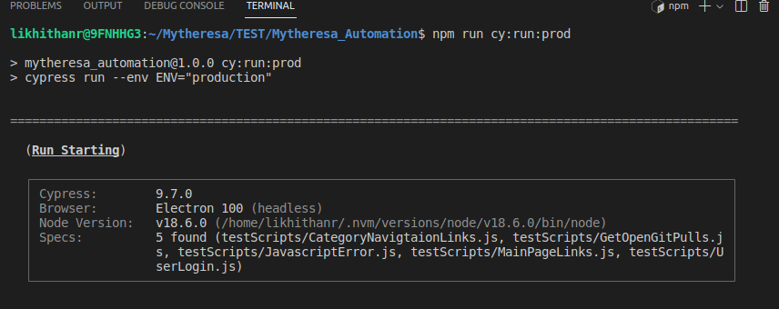
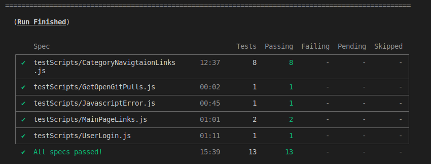

# Mytheresa Automation with Cypress

## Overview
This is a cypress framework designed to automate web application and backend API's using javascript. Cases covered are:
* Javascript error validation on Mytheresa Web UI
* Validating all the links and status codes
* Validating login feature
* Downloading all the open pull requests from  https://github.com/appwrite/appwrite/pulls in CSV format
* Basic and Test case challenge are included in BASIC.md and LOGINTESTPLAN.md respectively
## Prerequisites
* Cypress V9.7.0
* Node JS >14
* NPM

## Getting started
### Running test
* Clone the project

```bash
  git clone https://github.com/likhithanr/Mytheresa_Automation
```

* Go to the project directory
* Install dependencies 
```bash
  npm install 
```
* Running test
```bash
 npm run cy:run:<ENV>:<BROWSER>
```
 #### Ex: npm run cy:run:prod:chrome 
 Four environments are currently configured
 ```bash
 cy:run:prod:chrome      Runs the tests on "https://www.mytheresa.com/en-de/men.html"
 cy:run:stage:chrome     Runs the tests on "https://staging.mytheresa.com/en-de/men.html"
 cy:run:test:chrome      Runs the tests on "https://test.mytheresa.com/en-de/men.html"
 cy:run:loc:chrome       Runs the tests on "https://local.mytheresa.com/en-de/men.html"
 
```
### Downloading the open pull requests in CSV 

 ```bash
  npm run downloadOpenPulls
```
Downloads the open pull requests in CSV format under "downloads" folder of the project
Ex: Open_Pull_Requests_20_23_55.csv

## Screenshots
#### Test result snapshots


